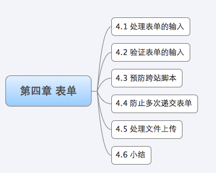

# 4 表單

表單是我們平常編寫 Web 應用常用的工具，透過表單我們可以方便的讓客戶端和伺服器進行資料的互動。對於以前開發過 Web 的使用者來說表單都非常熟悉，但是對於 C/C++程式設計師來說，這可能是一個有些陌生的東西，那麼什麼是表單呢？

表單是一個包含表單元素的區域。表單元素（比如：文字域、下拉列表、單選框、複選框等等）是允許使用者在表單中輸入資訊的元素。表單使用表單標籤（\<form\>）定義。

	<form>
	...
	input 元素
	...
	</form>

Go 裡面對於 form 處理已經有很方便的方法了，在 Request 裡面有專門的 form 處理，可以很方便的整合到 Web 開發裡面來，4.1 小節裡面將講解 Go 如何處理表單的輸入。由於不能信任任何使用者的輸入，所以我們需要對這些輸入進行有效性驗證，4.2 小節將就如何進行一些普通的驗證進行詳細的示範。

HTTP 協議是一種無狀態的協議，那麼如何才能辨別是否是同一個使用者呢？同時又如何保證一個表單不出現多次提交的情況呢？4.3 和 4.4 小節裡面將對 cookie(cookie 是儲存在客戶端的資訊，能夠每次透過 header 和伺服器進行互動的資料)等進行詳細講解。

表單還有一個很大的功能就是能夠上傳檔案，那麼 Go 是如何處理檔案上傳的呢？針對大檔案上傳我們如何有效的處理呢？4.5 小節我們將一起學習 Go 處理檔案上傳的知識。

## 目錄

## links
   * [目錄](<preface.md>)
   * 上一章：[第三章總結](<03.5.md>)
   * 下一節：[處理表單的輸入](<04.1.md>)
