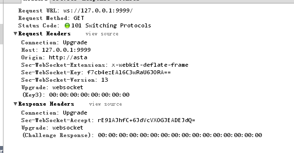

# 8.2 WebSocket
WebSocket 是 HTML5 的重要特性，它實現了基於瀏覽器的遠端 socket，它使瀏覽器和伺服器可以進行全雙工通訊，許多瀏覽器（Firefox、Google Chrome 和 Safari）都已對此做了支援。

在 WebSocket 出現之前，為了實現即時通訊，採用的技術都是“輪詢”，即在特定的時間間隔內，由瀏覽器對伺服器發出 HTTP Request，伺服器在收到請求後，回傳最新的資料給瀏覽器重新整理，“輪詢”使得瀏覽器需要對伺服器不斷髮出請求，這樣會佔用大量頻寬。

WebSocket 採用了一些特殊的報頭，使得瀏覽器和伺服器只需要做一個握手的動作，就可以在瀏覽器和伺服器之間建立一條連線通道。且此連線會保持在活動狀態，你可以使用 JavaScript 來向連線寫入或從中接收資料，就像在使用一個常規的 TCP Socket 一樣。它解決了 Web 即時化的問題，相比傳統 HTTP 有如下好處：

- 一個 Web 客戶端只建立一個 TCP 連線
- Websocket 伺服器端可以推送(push)資料到 web 客戶端.
- 有更加輕量級的頭，減少資料傳送量

WebSocket URL 的起始輸入是 ws://或是 wss://（在 SSL 上）。下圖展示了 WebSocket 的通訊過程，一個帶有特定報頭的 HTTP 握手被髮送到了伺服器端，接著在伺服器端或是客戶端就可以透過 JavaScript 來使用某種套介面（socket），這一套介面可被用來透過事件控制代碼非同步地接收資料。


圖 8.2 WebSocket 原理圖

## WebSocket 原理
WebSocket 的協議頗為簡單，在第一次 handshake 透過以後，連線便建立成功，其後的通訊資料都是以”\x00″開頭，以”\xFF”結尾。在客戶端，這個是透明的，WebSocket 元件會自動將原始資料“掐頭去尾”。

瀏覽器發出 WebSocket 連線請求，然後伺服器發出迴應，然後連線建立成功，這個過程通常稱為“握手” (handshaking)。請看下面的請求和反饋資訊：



圖 8.3 WebSocket 的 request 和 response 資訊

在請求中的"Sec-WebSocket-Key"是隨機的，對於整天跟編碼打交道的程式設計師，一眼就可以看出來：這個是一個經過 base64 編碼後的資料。伺服器端接收到這個請求之後需要把這個字串連線上一個固定的字串：

	258EAFA5-E914-47DA-95CA-C5AB0DC85B11

即：`f7cb4ezEAl6C3wRaU6JORA==`連線上那一串固定字串，產生一個這樣的字串：

	f7cb4ezEAl6C3wRaU6JORA==258EAFA5-E914-47DA-95CA-C5AB0DC85B11

對該字串先用 sha1 安全雜湊演算法計算出二進位制的值，然後用 base64 對其進行編碼，即可以得到握手後的字串：

	rE91AJhfC+6JdVcVXOGJEADEJdQ=

將之作為回應標頭`Sec-WebSocket-Accept`的值反饋給客戶端。

## Go 實現 WebSocket
Go 語言標準套件裡面沒有提供對 WebSocket 的支援，但是在由官方維護的 go.net 子套件中有對這個的支援，你可以透過如下的命令取得該套件：

	go get golang.org/x/net/websocket

WebSocket 分為客戶端和伺服器端，接下來我們將實現一個簡單的例子 : 使用者輸入資訊，客戶端透過 WebSocket 將資訊傳送給伺服器端，伺服器端收到資訊之後主動 Push 資訊到客戶端，然後客戶端將輸出其收到的資訊，客戶端的程式碼如下：

```html

<html>
<head></head>
<body>
	<script type="text/javascript">
		var sock = null;
		var wsuri = "ws://127.0.0.1:1234";

		window.onload = function() {

			console.log("onload");

			sock = new WebSocket(wsuri);

			sock.onopen = function() {
				console.log("connected to " + wsuri);
			}

			sock.onclose = function(e) {
				console.log("connection closed (" + e.code + ")");
			}

			sock.onmessage = function(e) {
				console.log("message received: " + e.data);
			}
		};

		function send() {
			var msg = document.getElementById('message').value;
			sock.send(msg);
		};
	</script>
	<h1>WebSocket Echo Test</h1>
	<form>
		<p>
			Message: <input id="message" type="text" value="Hello, world!">
		</p>
	</form>
	<button onclick="send();">Send Message</button>
</body>
</html>
```

可以看到客戶端 JS，很容易的就透過 WebSocket 函式建立了一個與伺服器的連線 sock，當握手成功後，會觸發 WebScoket 物件的 onopen 事件，告訴客戶端連線已經成功建立。客戶端一共綁定了四個事件。

- 1）onopen 建立連線後觸發
- 2）onmessage 收到訊息後觸發
- 3）onerror 發生錯誤時觸發
- 4）onclose 關閉連線時觸發

我們伺服器端的實現如下：

```Go
package main

import (
	"golang.org/x/net/websocket"
	"fmt"
	"log"
	"net/http"
)

func Echo(ws *websocket.Conn) {
	var err error

	for {
		var reply string

		if err = websocket.Message.Receive(ws, &reply); err != nil {
			fmt.Println("Can't receive")
			break
		}

		fmt.Println("Received back from client: " + reply)

		msg := "Received:  " + reply
		fmt.Println("Sending to client: " + msg)

		if err = websocket.Message.Send(ws, msg); err != nil {
			fmt.Println("Can't send")
			break
		}
	}
}

func main() {
	http.Handle("/", websocket.Handler(Echo))

	if err := http.ListenAndServe(":1234", nil); err != nil {
		log.Fatal("ListenAndServe:", err)
	}
}
```

當客戶端將使用者輸入的資訊 Send 之後，伺服器端透過 Receive 接收到了相應資訊，然後透過 Send 傳送了回應資訊。


圖 8.4 WebSocket 伺服器端接收到的資訊

透過上面的例子我們看到客戶端和伺服器端實現 WebSocket 非常的方便，Go 的原始碼 net 分支中已經實現了這個的協議，我們可以直接拿來用，目前隨著 HTML5 的發展，我想未來 WebSocket 會是 Web 開發的一個重點，我們需要儲備這方面的知識。


## links
   * [目錄](<preface.md>)
   * 上一節：[Socket 程式設計](<08.1.md>)
   * 下一節：[REST](<08.3.md>)
